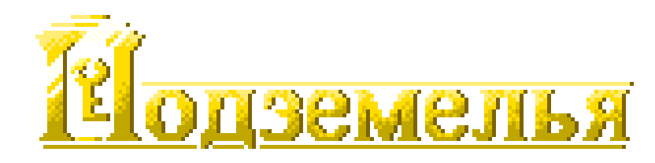
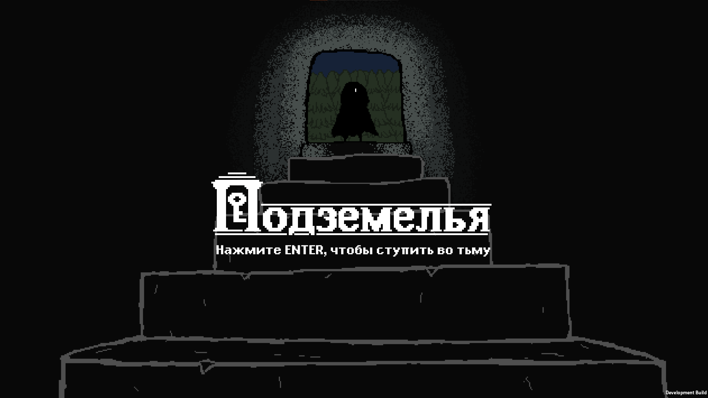
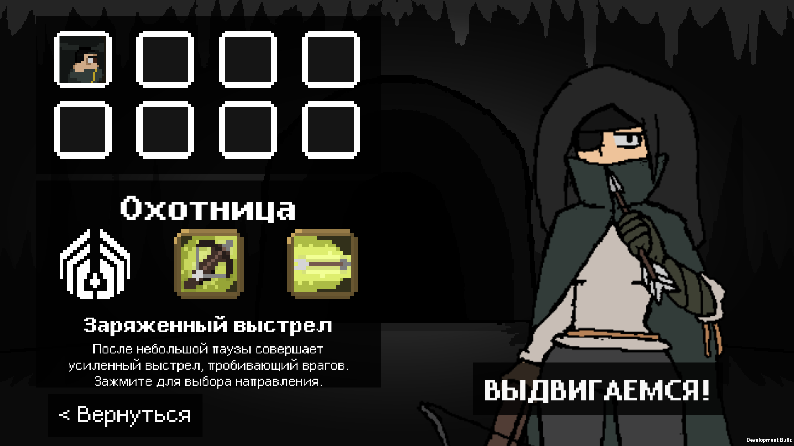
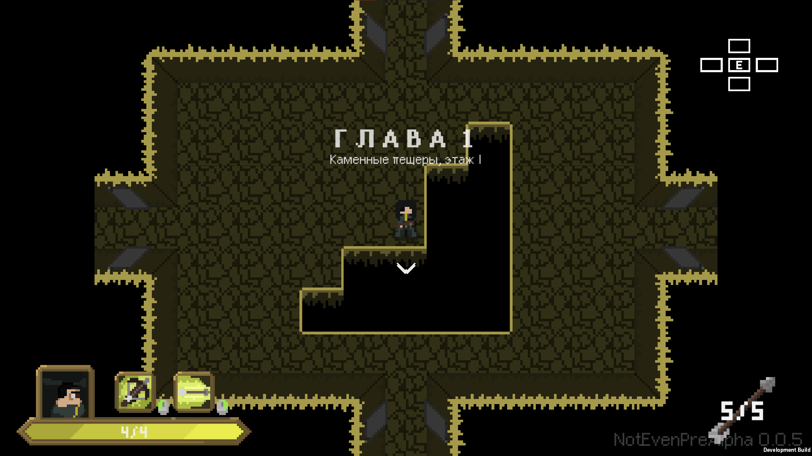
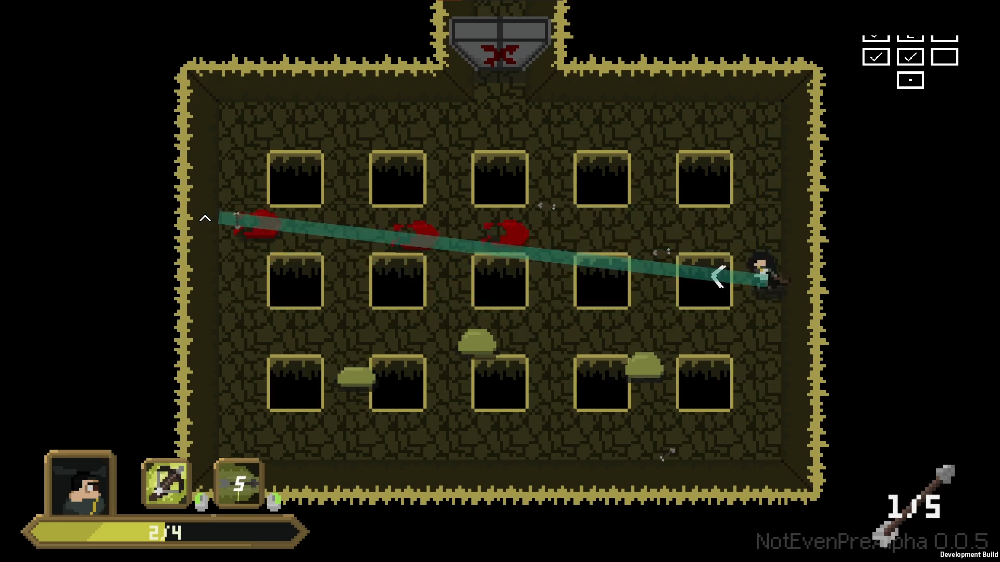
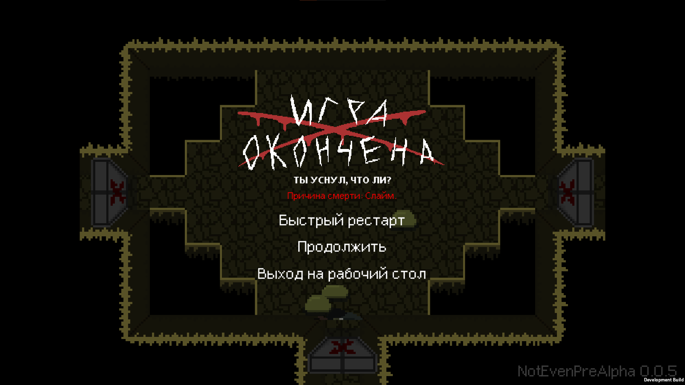

# [EN] UNDERCROFTS
Undercrofts is a little roguelike game which was made as a graduation work.
## What is it about?
Ever played The Binding of Isaac? Maybe Enter The Gungeon? If so, you already know what it is all about.
## But like, what EXACTLY you do in the game?
Well, let's take a look:

1. You can stare at this cool "Press ENTER" screen! I spent so much time designing these cool animations!

2. Before the run, you need to choose one of [REDACTED] playable characters, each with their own unique gameplay style! 
Although, we have ONLY one character ready... but you wait!

3. After you choose the character, you are sent straight into the UNDERCROFTS! 
The thing is - each time you start a new run, the layout is completely different! You have to blindly explore the maze to find the exit to the next level!

4. And while doing so, you will have to FIGHT HORDES of spooky scary enemies! 
As of now, the bestiary consists only of not really impressive and actually quite dumb GREEN SLIMES... but you just wait!

4. But if you have enough skill issue, you can even DIE to them! 
And like in any good roguelike, dying means you have to start the exploration all over again! The game even MOCKS you!
## I'm sooo exited, how do I download the game?
1. [Here](https://github.com/TheSund/UNDERCROFTS/releases "Yes, here!") choose and download preferred version of the game.
2. Extract the archive with the game somewhere on your disk.
3. ???
4. Profit! Now you can play. **If you know russian language. I, like, had no time nor will do make a proper multilanguage syste-**

## What are the controls of the game?
<ul>
  <li> WASD keys - move around</li>
  <li> Mouse movement - aim your attacks</li>
  <li> Left and Right mouse buttons - use character's attacks</li>
  <li> E key - use interactable objects (like the trapdoor to the next level)</li>
</ul>

 
Hope you like the game even in this unfinished state! See ya in the <b>UNDERCROFTS!</b>

# [RU] ПОДЗЕМЕЛЬЯ
ПОДЗЕМЕЛЬЯ - игра в жанре "roguelike", изначально созданная как проект для дипломной работы.
## О чем игра?
Играли когда-нибудь в The Binding of Isaac? Может быть, в Enter The Gungeon? Если да, то тебе и так будет понятно, о чем игра.
## Но, типа, что КОНКРЕТНО в игре нужно делать?
Что ж, давай взглянем:

1. ТЫ можешь пялиться на этот крутой экран "Нажмите ENTER"! Я столько времени потратил на эти крутые анимации!

2. Перед забегом, тебе нужно выбрать одного [УДАЛЕНО]и играбельных персонажей, каждый из которых имеет свой уникальный стиль игры! 
Правда, пока что у нас готов всего лишь ОДИН персонаж... но вы подождите!

3. Когда определитесь с персонажем, вы сразу отправляетесь в ПОДЗЕМЕЛЬЯ! 
Прикол вот в чем - когда вы начинаете новый забег, устройство уровней каждый раз будет совсем другим! Тебе придется вслепую исследовать лабиринт комнат, чтобы найти выход на следующий уровень!

4. И пока ты гуляешь, тебе придется СРАЖАТЬСЯ с ОРДАМИ жутко страшных противников! 
Пока что, весь бестиарий включает в себя только не очень-то впечатляющих и очень даже глупых ЗЕЛЕНЫХ СЛАЙМОВ... но ты только подожди!

4. Но если у тебя достаточно проблем со скиллом, то ты можешь ПОМЕРЕТЬ от них! 
И как в любом хорошем рогалике, смерть означает, что исследование нужно начинать с самого начала! Игра даже насмехается над тобой!
## Я таааак впечатлен, как мне скачать игру?
1. [Здесь](https://github.com/TheSund/UNDERCROFTS/releases "Да-да, сюда!") выбери и скачай последнюю версию игры.
2. Распакуй скачанный архив с игрой в желаемое место на диске.
3. ???
4. Готово! Можешь играть.

## А какое управление в игре?
<ul>
  <li> Клавиши WASD - движение по уровню</li>
  <li> Движение мышкой - направляй свои атаки</li>
  <li> Левая и Правая кнопки мыши - использование атак персонажа</li>
  <li> Клавиша E - использование/взаимодействие с объектами (например, с люком, ведущим на следующий уровень)</li>
</ul>

 
Надеюсь, тебе понравится игра даже в таком незаконченном состоянии! Увидимся в <b>ПОДЗЕМЕЛЬЯХ!</b>
